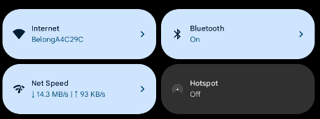
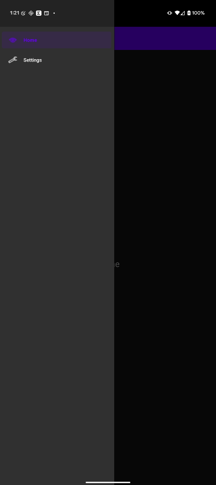
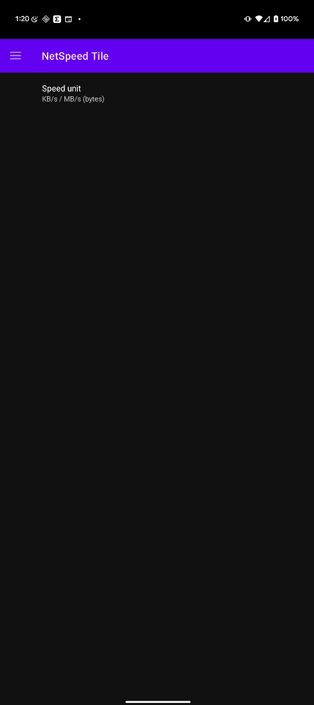

# NetSpeed Tile  📶⚡

An open-source Android app that adds a **Quick Settings tile** showing your current
download ↓ and upload ↑ speed — right where you can see it.  
Choose **bits (kbps / mbps)** or **bytes (KB/s / MB/s)**, tweak in-app settings,
and enjoy a modern Material 3 UI with a navigation-drawer home screen.

| | |
|---|---|
| **Package** | `com.example.netspeedtile` |
| **Min SDK** | 24 (Android 7.0) |
| **Language** | Kotlin |
| **License** | MIT |

---

## ✨ Features
* **Live speed read-out** every second using `TrafficStats`
* Auto-unit: shows kbps → mbps (or KB/s → MB/s) when > 1 000 k
* One-tap **unit switch** (bits ↔︎ bytes) in Settings
* Material 3 UI – light & dark compatible
* Drawer navigation with *Home* and *Settings*
* No ads, no tracking, 100 % offline

---

## 📸 Screenshots

<p align="center">
  
  
  
</p>


---

## 🔧 Building

1. **Clone**
   ```bash
   1. git clone https://github.com/<you>/NetSpeedTile.git
2. **Open in Android Studio (Giraffe or newer)**
3. **Let Gradle sync & hit ▶︎  (Run)**

## Permissions

The only special permission required is
android.permission.BIND_QUICK_SETTINGS_TILE – it’s automatically granted when
the user places the tile.

## 📲 Installing

Grab the latest app‑release.apk from the
Releases page and sideload — or build it yourself.

## 🤝 Contributing

PRs & issues are welcome! If you have an idea or find a bug, please open an Issue first.

    1. Fork → feature branch → commit (use Conventional Commits, e.g. "feat: add …")
    2. ./gradlew lint ktlintFormat   # pass the CI checks
    3. Open a Pull Request ✔︎ 

## 🛡️ License
MIT License

Copyright (c) 2025 md arafat hossain

    Permission is hereby granted, free of charge, to any person obtaining a copy
    of this software and associated documentation files (the "Software"), to deal
    in the Software without restriction, including without limitation the rights


Built with ❤️ + Kotlin coroutines — may your pings be low and your speeds be high!


